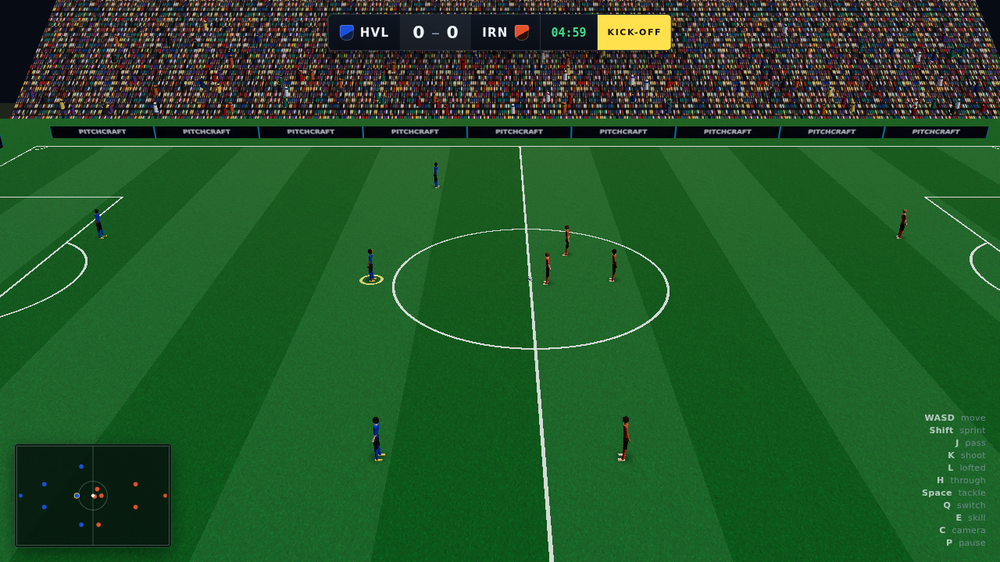
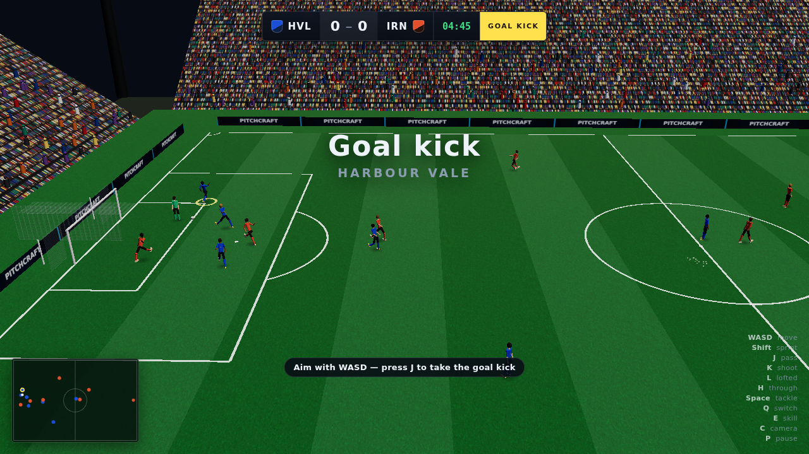
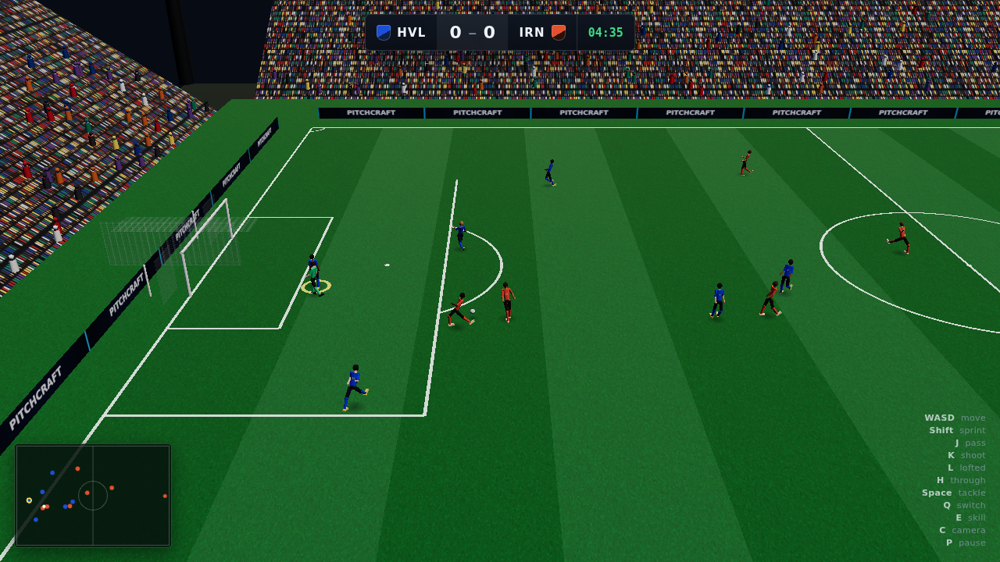
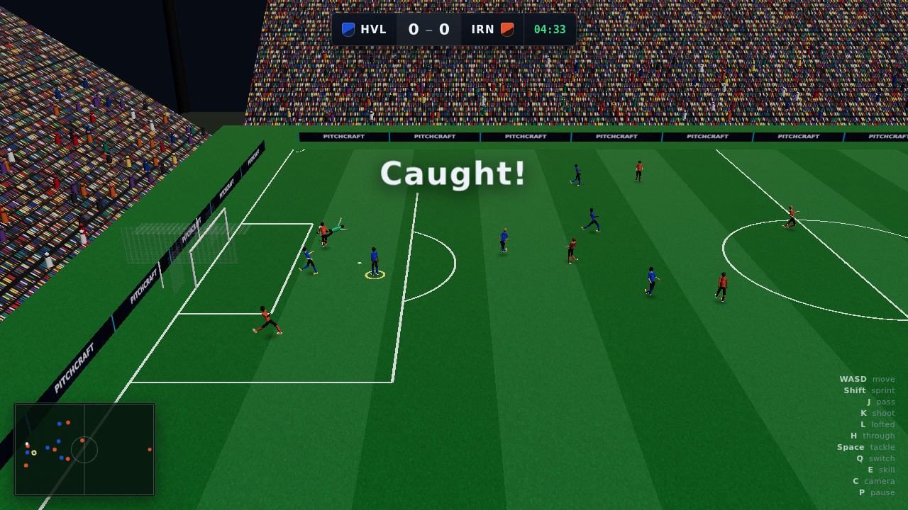
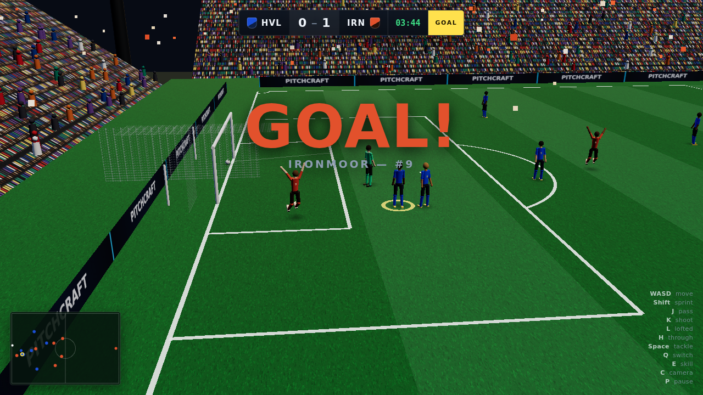
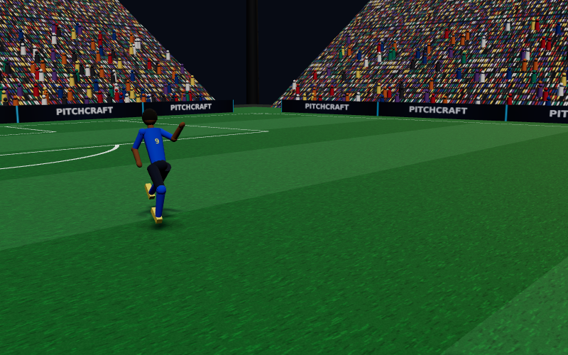
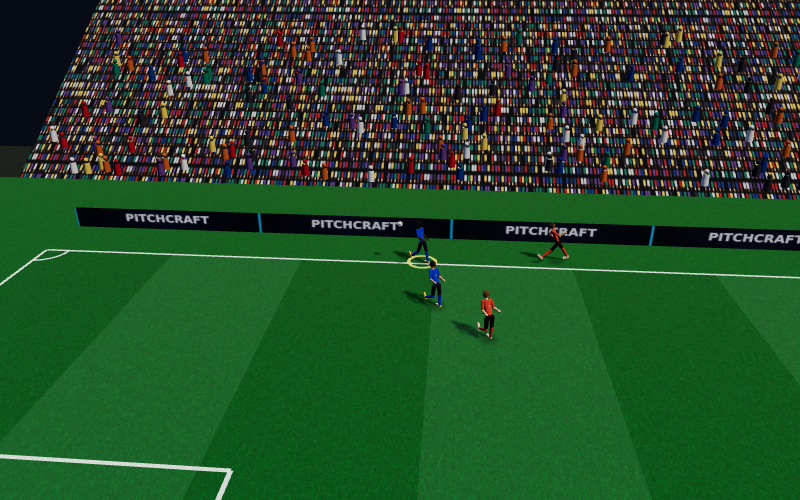

# Pitchcraft

An original browser-based 3D football match simulator, built with Three.js.

One polished 7v7 match: you against a competent AI, five minutes, kickoff to
full time, with real ball physics, tactical team behaviour and a broadcast
presentation. Everything you see and hear — turf, stadium, crowd, players,
animation, sound — is generated procedurally at runtime. There are no external
art or audio assets, and nothing here imitates any real club, competition,
player or product.



---

## Run it

Requires Node 18+ and a modern desktop browser with WebGL2.

```bash
cd pitchcraft
npm install
npm run dev
```

Then open the URL Vite prints (usually <http://localhost:5173>).

For a production build:

```bash
npm run build
npm run preview      # serves the built game on http://localhost:4173
```

Add `?quality=low`, `?quality=medium` or `?quality=high` to the URL to change
crowd density, shadows and pixel ratio. High is the default.

---

## Controls

| Action | Keyboard | Gamepad |
|---|---|---|
| Move | `W` `A` `S` `D` or arrow keys | Left stick |
| Sprint | hold `Shift` | `RT` |
| Short pass | `J` (hold for weight) | `A` |
| Through ball | `H` | `X` |
| Lofted pass / cross | `L` (hold for weight) | `Y` |
| Shoot | `K` (hold to charge) | `B` |
| Tackle / press | `Space` | `RB` |
| Switch player | `Q` or `Tab` | `LB` |
| Skill move | `E` | — |
| Toggle camera | `C` | — |
| Pause | `P` or `Esc` | `Start` |
| Restart match | `R` | `Back` |
| Performance overlay | `F3` | — |

Movement is camera-relative. Aiming is assisted but always respects your
direction — pointing somewhere deliberate beats the assist.

You play **Harbour Vale** (blue). Control automatically follows whoever wins the
ball, and switches to the likely receiver while a pass is in flight; press `Q`
any time to override.

---

## What's implemented

**Ball physics.** The ball is an independent rigid body and is never attached to
a player's foot. Rolling friction, bounce, air drag, Magnus curve from spin,
post and crossbar rebounds, body deflections, loose-ball contests. Pass speeds
are solved by inverting the rolling model, so a pass aimed at a team-mate
actually arrives at them at a controllable pace.

**Player control.** Acceleration and momentum with speed-dependent turn rate —
running flat out and trying to turn costs you. Sprinting drains stamina.
Dribbling pushes the ball further ahead the faster you go, so sprinting with the
ball is genuinely riskier.

**Team AI.** Role-based and deterministic, not eleven players chasing a ball.
Each tick classifies the team phase, gives every player one job (press, mark,
cover, support, run, chase), and scores every available pass on progression, lane
safety, receiver space and goal threat. Attackers hold width and make runs off
the last defender; defenders keep shape, press selectively and stay goal-side.

**Goalkeepers.** A proper state machine — position on the angle, react, dive,
catch or parry, recover, distribute. They come for balls they can genuinely reach
and stay home when they can't.

**Match rules.** Kickoff, goals, throw-ins, corners, goal kicks, restart
clearances, match clock, pause, full time with statistics, and play again.

**Presentation.** Broadcast camera that tracks the shape of the play rather than
jittering after the ball, floodlit stadium with a reactive crowd, procedural
players with kits and shirt numbers, procedural animation keyed to actual
movement speed, and a synthesised audio layer that responds to match events.

---

## Screenshots

| | |
|---|---|
|  |  |
|  |  |
|  |  |

---

## Development

```bash
npm test                        # 71 automated tests
node tools/headlessMatch.js 10  # balance over 10 full AI-vs-AI matches
node tools/diagnose.js 6        # attribute every dead ball to its cause
node tools/capture.js           # drive the built game in Chromium + screenshot
node tools/closeup.js           # fixed-camera inspection shots
```

The simulation has **no dependency on Three.js or the DOM**, so a complete match
runs headless in Node at ~260x realtime. That is what made it possible to measure
balance across many matches instead of guessing — every significant gameplay bug
in this project was found by instrumentation rather than by eye.

### Project layout

```
src/
  core/     config, maths, seeded RNG, event bus, perf monitor
  sim/      ball physics, player kinematics, kick model, contacts
  ai/       team AI, goalkeeper AI
  match/    phases, clock, laws, restarts
  control/  input abstraction, human player controller
  render/   scene, pitch, stadium, characters, animation, camera, effects
  audio/    WebAudio synthesis
  ui/       broadcast HUD and styles
tools/      headless runner, diagnostics, browser capture
tests/      vitest suites
```

All gameplay tuning lives in `src/core/config.js`. Switching to 11v11 is a matter
of changing `PITCH.length` / `PITCH.width` and passing the `11v11` formation —
the formation template is defined in normalised pitch space and everything
derives from it.

### Documentation

- [`PLAN.md`](PLAN.md) — architecture, scope, risk register
- [`DESIGN_DECISIONS.md`](DESIGN_DECISIONS.md) — decisions and the measurements behind them
- [`TESTS.md`](TESTS.md) — test coverage and measured results
- [`TASKS.md`](TASKS.md) — status and the five highest-value next improvements
- [`KNOWN_ISSUES.md`](KNOWN_ISSUES.md) — limitations, stated honestly

---

## Known limitations

The full list is in [`KNOWN_ISSUES.md`](KNOWN_ISSUES.md). The three that matter
most:

1. **Characters don't deform.** Players are a rigid-segment rig with joint
   spheres. Fine at gameplay distance, clearly a mannequin up close. Replacing it
   with a skinned mesh is the biggest available visual win.
2. **60 fps is unverified on real hardware.** The build environment has no GPU,
   so the only frame rates ever measured came from a software rasteriser and are
   meaningless. Per-frame workload (~350 draw calls, ~180k triangles) is modest,
   but that is an argument, not a measurement.
3. **No human has play-tested it.** All tuning was validated through proxy
   metrics — close-control share, pass tempo, acceleration curves — not by
   someone holding the controls.

Also absent by design: offside, fouls and cards, half-time, and mobile support.

---

## Licence and originality

All code, art, geometry, textures and audio in this project are original and
generated at runtime. Team names, kits, colours, crest shapes and the stadium are
invented. No club, league, player likeness, branding, kit design, stadium, audio
or code from any commercial football game is used or reproduced. Commercial
football games were used only as a quality reference.
